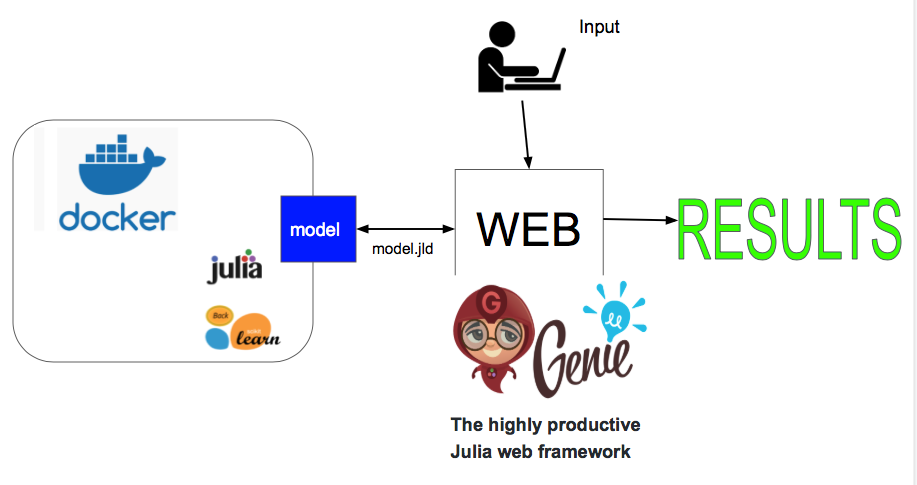

# Julia ML Project to Production

<div align="center">
    
</div>

<br>

## Project Description

#### Problem

How are Julia derived machine learning models pushed to production? In short, is there a simple example that can walk Julia users through the process?

#### Why it needs to be addressed

Data scientists, machine learners, and Julia enthusiasts want to understand how to present learning model outputs via a browser.

#### Proposed Solution

This repository contains code examples, text files, IJulia notebooks, and other general materials related to educating users on how they can build a machine learning prediction model and then allow access of that model via a Web framework like Genie.jl.

It uses the `ScikitLearn.jl` module to:

- produce a machine learning pipeline,
- apply feature engineering to allow for possible `polynomial feature` construction,
- perform scaling via `MinMaxScaler()`,
- select important features using `SelectPercentile()`,
- test scaled features against other well known models like `RandomForestClassifier`,
- apply `GridSearchCV` for testing model `hyperparameters`, and
- reveal the best lerning model

It serializees the derived prediction model using `Julia JLD`

And, finally, in a separate script file `rest.jl`, the project uses the Genie.jl Web framework to render the model via a webpage.

#### Solution Summary

In summary, the project reveals how one might make a Machine Learning module available via a web interface all in Julia without reprogramming the learning model in another language like Java or C (i.e., avoiding the two programming language problem).

The code and examples are purely for educational purposes and were developed as a Proof of Concept (POC). The project's results were used for a Machine Learning Tech Talk for one of Akamai Technologies, Inc's mPulse team's "Learning Tuesdays" team talks, a biweekly talk given by a different member of the Akamai mPulse Data Science team.

## Tech Stack


## Getting Started

You will need to use the specified Docker image and the repo files or install Julia and IJulia to utilize the Jupyter notebooks and files in this repository.

## Installation Steps

### Using a Docker Container

The code here was run in a Docker container generated from the `jupyter/datascience-notebook` docker image, which provided a nice sandbox environment for running Julia version 1.1.0 code and Jupyter notebooks easily.

Plus, you can easily delete the container and images once finished for those resource focused! :smiley:

#### Pull the Docker Image

#### Installing Docker

Please go [here](https://docs.docker.com/get-started/) to see how get Docker installed on your machine if you do not already have it, and to understand common Docker commands needed for the project.

#### Getting the Docker Image

- Open your terminal or command prompt.
- Run the following command to pull the Docker image from DockerHub:
  ```
  docker pull jupyter/datascience-notebook
  ```
  This command downloads the Docker image from DockerHub.

#### **Run the Docker Container**

- Start the Docker container by running the following command from a terminal command line. Adjust the port mapping as needed:

  ```
  docker run --name <what_you_named_the_container> jupyter/datascience-notebook
  ```

  This command builds and runs the container based on the docker image file.

- Add notebook and other files cloned from the repo to your container

  - First download or clone the repo or specific files onto your host machine. You will be able to run the notebook or .jl files
    from within the container this way.

  -To add files that you have stored on your host machine to a Docker container use the `docker cp` command.

  Using `docker cp` at a terminal command line:

  ```
  docker cp <host_path> <container_name_or_id>:<container_path>
  ```

  This command copies files or directories from your host to a running container.

  - <host_path>: The path of the file or directory on your host machine.
  - <container_name_or_id>: The name or ID of the container.
  - <container_path>: The path within the container where you want to copy the files.

  For example,

  ```
  docker cp ./my_file.txt my_container:/path/to/destination
  ```

  copies my_file.txt from your host to /path/to/destination (e.g., /home/project) within the my_container

- Run a Bash shell in the Docker container which will allow you to interact with the container's shell directly.

  At a terminal command line, use the command:

  ```
  docker exec -it <container-name> bash #where <container-name> is the name or ID of the running container.
  ```

  This will open a bash terminal inside the container

- From within this bash terminal, launch the Julia read-eval-print loop (REPL) interactve command line.

  ```
  bash# julia
  ```

- Within the Julia REPL launch the Jupyter notebook by issuing the followng:

  ```
  julia> using IJulia
  julia> notebook()
  ```

- Now you can simply run the copied files or generate a new notebook and replicate the code.

Of course, you can run the code in a notebook or `.jl` scripts after installing Julia and IJulia as outlined below.

### Alternatively, Install Julia and then IJulia to use a Julia Juypter Notebook

You will need at least Julia version 1.1.0 or higher.

1. **juliaup**

A recommended way to install Julia is to install [juliaup](https://github.com/JuliaLang/juliaup) which is a small, self-contained binary that will automatically install the latest stable Julia binary and help keep it up to date. It also supports installing and using different versions of Julia simultaneously.

Install `juliaup` by running this in your terminal:

```
curl -fsSL https://install.julialang.org | sh

```

This will install the latest stable version of Julia, which can be launched from a command-line by typing `julia` as well as the `juliaup` tool. To install different Julia versions see `juliaup --help`.

2. **Downloads**
   If you want to manually download and install specific Julia versions, see the [Downloads](https://julialang.org/downloads/) page.

### Install IJulia to Use Jupyter Notebooks

Install `IJulia` using instructions [here](https://github.com/JuliaLang/IJulia.jl)

#### Running the Code

To test out the code as is. <br>

1. Run the `julia_ml_2_production_model.ipynb` notebook which will build and save
   your machine learning binary classifier model `cancer_model_jld`

2. next from a command terminal prompt run `$julia runtest.jl`. This action will
   retrieve the classifier model, start the genie.jl webserver and allow you from a browser
   or via `curl` commands to execute REST commands to the server. - for example `curl localhost:8000/sum/2/3?initial_value=10` at the command line
   will yield the value 15. This is a test to make sure all is working - `curl localhost:8000/predict` will actually run a test case of model prediction
   using a predefined benign data set of 30 features.

### Data Sources

The data was obtaind from the `UCI ML Breast Cancer Wisconsin (Diagnostic) dataset`

```
https://scikit-learn.org/stable/modules/generated/sklearn.datasets.load_breast_cancer.html
```

## Final Words

Thanks for visiting.

Give the project a star (⭐) if you liked it or if it was instructional for you!

You've `beenlanced`! 😉
<br>
## Acknowledgements

I would like to extend my gratitude to all the individuals and organizations who helped in the development and success of this project. Your support, whether through contributions, inspiration, or encouragement, have been invaluable. Thank you.

Specifically, I would like to acknowledge:

- The folks at [Julialang.org](https://julialang.org/) for their installation instructions and up-to-date information on the happenings with Julia.

- [Hema Kalyan Murapaka](https://www.linkedin.com/in/hemakalyan) and [Benito Martin](https://martindatasol.com/blog) for sharing their README.md templates upon which I have derived my README.md.

## License

This project is licensed under the MIT License - see the [LICENSE](./LICENSE) file for details
